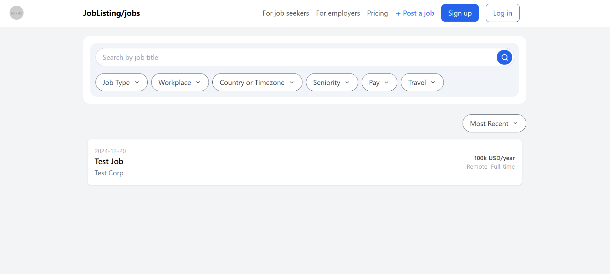

# Job Listing Scraper and Management

## Overview
This project is a job listing scraper and management system. It uses the Scrapy framework to scrape job data from websites, handles pagination via API calls, and integrates with a Django backend to store scraped job data into a MySQL database. The project also provides a frontend for managing job listings.

---

## Features
- **Web Scraping**: Scrape job data, including job title, description, company name, and other relevant details.
- **API Integration**: Handle pagination using API calls to fetch job listings.
- **Django Integration**: Store scraped data into a MySQL database via Django.
- **Frontend Application**: Manage job listings through a user-friendly interface.

---

## Tech Stack

### Backend
- **Django**: Web framework for handling data storage and APIs.
- **MySQL**: Database for storing job listings.

### Scraping
- **Scrapy**: Framework for web scraping.
- **Requests**: To handle API calls.

### Frontend
- **React.js**: Frontend framework for the user interface.

---

## Prerequisites

1. Python (>= 3.9)
2. Node.js and npm (for frontend development)
3. MySQL Server
4. Django and Scrapy libraries

---

## Installation and Setup

### Clone the Repository
```bash
git clone https://github.com/prachisamuel/Job-Listing.git
cd backend/joblisting
```

### Backend Setup
1. Create a virtual environment:
   ```bash
   python -m venv venv
   source venv/bin/activate  # On Windows: venv\Scripts\activate
   ```

2. Install required Python libraries:
   ```bash
   pip install -r requirements.txt
   ```

3. Set up the MySQL database:
   - Create a database named `joblisting`.
   - Update `settings.py` in the Django project with your database credentials:
     ```python
     DATABASES = {
         'default': {
             'ENGINE': 'django.db.backends.mysql',
             'NAME': 'joblisting',
             'USER': 'your-username',
             'PASSWORD': 'your-password',
             'HOST': 'localhost',
             'PORT': '3306',
         }
     }
     ```

4. Run migrations:
   ```bash
   python manage.py makemigrations
   python manage.py migrate
   ```

5. Start the backend server:
   ```bash
   python manage.py runserver
   ```

### Frontend Setup
1. Navigate to the `frontend` directory:
   ```bash
   cd frontend
   ```

2. Install dependencies:
   ```bash
   npm install
   ```

3. Start the React development server:
   ```bash
   npm start
   ```

### Scraping Setup
1. Navigate to the `scraper` directory:
   ```bash
   cd scraper/job_scraper
   ```

2. Run the Scrapy spider to scrape data:
   ```bash
   scrapy crawl job_spider
   ```

3. After scraping, the data will be sent to the Django backend via a POST request.

---

## Screenshots



## Contributing
Contributions are welcome! Please fork the repository and submit a pull request.

---

## Acknowledgments
- **Django Documentation**: [https://docs.djangoproject.com/](https://docs.djangoproject.com/)
- **Scrapy Documentation**: [https://docs.scrapy.org/](https://docs.scrapy.org/)
